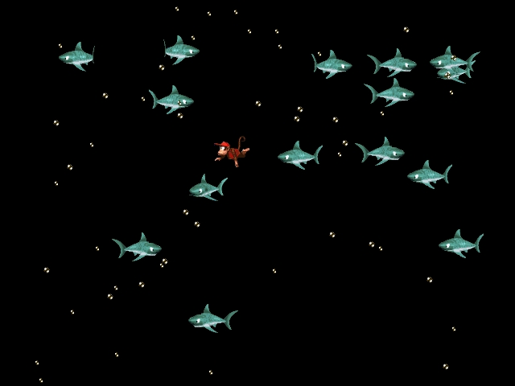



## DirectDraw Sharks

### Description

This program uses DirectDraw 7 to display sharks swimming around and other stuff (check the screenshot). I created this because I 'discovered' class modules to move sprites around which simplifies the code alot, and allows easy implementation of more sprites. The sprites have been taken from the SNES game 'Donkey Kong Country', that explains the monkey :-). The program runs really great, even on my P133 with 1000 sharks... maybe someone could help me create a screensaver out of this?

As usual, please leave feedback so I know what people think about it...
 
### More Info
 

             |
---                |---
**Submitted On**   |2000-12-29 12:50:10
**By**             |[Mark van Renswoude](https://github.com/Planet-Source-Code/PSCIndex/blob/master/ByAuthor/mark-van-renswoude.md)
**Level**          |Intermediate
**User Rating**    |4.9 (132 globes from 27 users)
**Compatibility**  |VB 5\.0, VB 6\.0
**Category**       |[DirectX](https://github.com/Planet-Source-Code/PSCIndex/blob/master/ByCategory/directx__1-44.md)
**World**          |[Visual Basic](https://github.com/Planet-Source-Code/PSCIndex/blob/master/ByWorld/visual-basic.md)
**Archive File**   |[CODE\_UPLOAD1313612292000\.zip](https://github.com/Planet-Source-Code/mark-van-renswoude-directdraw-sharks__1-13928/archive/master.zip)

